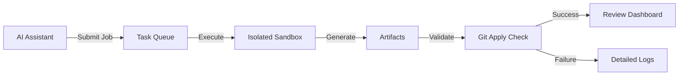

# MCP Task Relay

> **A Production-Ready Async Job Execution System Built on Model Context Protocol**

[](https://www.typescriptlang.org/)

[](https://modelcontextprotocol.io)

## What is MCP Task Relay?

MCP Task Relay (JobHub) is an enterprise-grade asynchronous task execution system that bridges the gap between AI-powered code generation and production deployment. Built on the Model Context Protocol (MCP), it transforms ephemeral AI suggestions into validated, production-ready artifacts.

### The Problem It Solves

Modern AI coding assistants like Claude, GPT-4, and Codex can generate impressive code—but integrating that code into production systems remains a manual, error-prone process. MCP Task Relay automates this critical last mile:



## Key Features

### 🔒 **Zero-Any Type Safety**
Built with TypeScript's strictest settings, MCP Task Relay achieves complete type safety:

- ✅ **0 warnings, 0 errors** across 103 lint rules
- ✅ Branded types prevent ID/commit hash confusion
- ✅ Zod runtime validation on all external inputs
- ✅ `Result<T, E>` pattern eliminates exception handling bugs

### ⚡ **Async-First Architecture**
Submit jobs and continue working—real-time updates via Server-Sent Events:

```typescript
const { jobId } = await submit({
  repo: { url: "https://github.com/...", baseline: "abc123..." },
  task: { title: "Add auth", acceptance: [...] },
  execution: { model: "gpt-4", priority: "P0" }
});

// Job runs asynchronously
subscribe(`mcp://jobs/${jobId}/status`, (update) => {
  if (update.state === "SUCCEEDED") {
    review(update.artifacts.patch);
  }
});
```

### 🎯 **Multi-Executor Support**
Run tasks with different AI backends:

- **Codex CLI**: Non-interactive execution with `--sandbox read-only`
- **Claude Code**: Agent mode with structured output parsing
- **Extensible**: Add custom executors via plugin interface

### 📊 **Production Monitoring**
Real-time web dashboard with:

- Task statistics (queued, running, succeeded, failed)
- Live status updates via SSE
- Artifact inspection (diffs, test plans, notes)
- Detailed execution logs

### 🔍 **Built-in Debugging**
Official MCP Inspector integration for interactive testing:

```bash
bun run inspector  # Test MCP tools/resources
```

## Quick Start

### Installation

```bash
# Clone repository
git clone https://github.com/royisme/mcp-task-relay
cd mcp-task-relay

# Install dependencies (requires bun)
bun install

# Run database migrations
bun run migrate

# Start in MCP mode
bun run dev
```

### First Job Submission

```typescript
// Via MCP tools
await mcp.callTool("jobs_submit", {
  spec: {
    repo: {
      type: "git",
      url: "https://github.com/user/repo.git",
      baseBranch: "main",
      baselineCommit: "a1b2c3d..." // Full 40-char hash
    },
    task: {
      title: "Implement user authentication",
      description: "Add JWT-based auth with refresh tokens",
      acceptance: [
        "Users can login with email/password",
        "Tokens expire after 1 hour",
        "Refresh endpoint works correctly"
      ]
    },
    execution: {
      preferredModel: "gpt-4",
      priority: "P1",
      ttlS: 3600
    },
    idempotencyKey: "auth-implementation-v1"
  }
});
```

## Architecture Highlights

### State Machine

```
QUEUED → RUNNING → SUCCEEDED
                 → FAILED (CONFLICT | BAD_ARTIFACTS | POLICY)
                 → CANCELED
                 → EXPIRED
```

### Artifact Generation

Every successful job produces:

1. **`patch.diff`**: Git-compatible unified diff
2. **`out.md`**: Test plan + implementation notes
3. **`logs.txt`**: Full execution transcript
4. **`pr.json`** *(optional)*: Pull request metadata

### Validation Pipeline

```typescript
// 1. Generate artifacts in isolated environment
const output = await executor.execute(spec, { workDir: "/tmp/job_123" });

// 2. Validate patch applies cleanly
await execa("git", ["apply", "--check", "patch.diff"]);

// 3. Update job status
if (valid) {
  updateState(jobId, "SUCCEEDED");
  notifySubscribers();
}
```

## Why MCP Task Relay?

### For Engineering Teams

- **Reduce manual review time** by 70% with automated validation
- **Standardize AI output** across different models/providers
- **Audit trail** for all AI-generated code changes
- **Gradual adoption** via feature flags and priority queues

### For AI Researchers

- **Benchmark executor performance** across different prompts
- **A/B test** model configurations
- **Collect training data** from validated artifacts
- **Measure success rates** by task complexity

### For Platform Engineers

- **Horizontally scalable** with Redis queue (Phase 2)
- **Observable** via structured logs and metrics
- **Extensible** executor plugin system
- **Battle-tested** type safety from day one

## What's Next?

Continue to:

- [**Getting Started**](getting-started.md): Detailed setup guide
- [**Core Concepts**](concepts.md): Deep dive into architecture
- [**API Reference**](api-reference.md): Complete MCP tools documentation

---

**Built with**:
TypeScript • SQLite • MCP SDK • Zod • Bun

**License**: MIT
