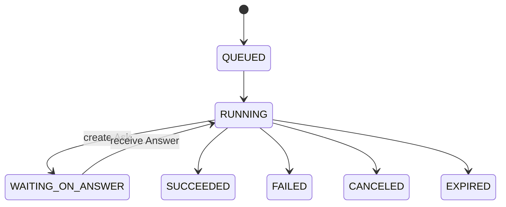

# Phase 2 Development Spec (Draft)

**Version:** 0.1 (Draft)  \
**Date:** 2025-11-12  \
**Owner:** Roy (Tech Lead)

---

## 0. Overview

Phase 2 introduces an interactive **Ask/Answer** collaboration loop between the **Executor** and **Scheduler**, plus a lightweight, short-lived **answer-runner** that lives on the Scheduler side. The goals are to keep the main LLM context focused, minimize token usage, and formalize **policy enforcement, caching, telemetry, and human-in-the-loop approvals**.

### Objectives

* Add an Ask/Answer protocol with a new `WAITING_ON_ANSWER` job state.
* Ship an answer-runner (code execution + on-demand MCP tool loading) managed by the Scheduler.
* Provide a **Role Catalog** (YAML) and **Prompt Layering** (Base → Role → Context → Task) for reproducible outputs.
* Implement a **Decision Cache** and **Policy Engine** with read-only enforcement and human approval hooks.
* Expose **Server-Sent Events (SSE)** for push updates (in addition to long-poll v1).
* Strengthen **observability** (metrics, logs, traces) and **security** (minimal permissions, audit trail).

### Non-Goals

* No distributed message bus yet (stay with HTTP + SQLite WAL).
* No PR automation or multi-executor sharding (planned for Phase 3).

### Success Metrics

* p95 Ask→Answer latency ≤ 3s (no MCP) and ≤ 8s with up to 2 MCP read calls.
* Average Ask token usage reduced by ≥ 35% vs Phase 1.
* Decision cache hit-rate ≥ 25% on repetitive workflows.
* JSON conformance errors < 2% with schema validation.

---

## 1. Architecture Changes

### 1.1 High-Level Diagram

```
Executor ──HTTP────► Scheduler (API)
   │                   │
   │                   ├─► Answer-Runner (short-lived, code exec)
   │                   │     ├─(on-demand) MCP Tools (read-only)
   │                   │     └─ Policy Engine + Decision Cache
   │                   │
   │◄── SSE/Long-Poll ─┤  (Answer streaming + status)
   │                   │
   └─ Artifacts ◄──────┴─ Filesystem (local) + SQLite (WAL)
```

### 1.2 State Machine (`WAITING_ON_ANSWER`)



* Lease/heartbeat stays active while in `WAITING_ON_ANSWER` (configurable TTL).

---

## 2. Protocol & Data Models

### 2.1 Message Types (JSON-only)

* `Ask` (Executor → Scheduler)
* `Answer` (Scheduler → Executor)
* `Log` (optional)
* `Heartbeat` (optional)

### 2.2 TypeScript Schemas (Zod)

```ts
import { z } from "zod";

export const AskType = z.enum([
  "CLARIFICATION",   // clarification for missing parameters
  "RESOURCE_FETCH",  // read-only config/schema/file access
  "POLICY_DECISION", // automatic policy evaluation
  "APPROVAL",        // manual approval required
  "CHOICE"           // pick one of several options
]);

export const AskPayload = z.object({
  type: z.literal("Ask"),
  ask_id: z.string().uuid(),
  job_id: z.string(),
  step_id: z.string(),
  ask_type: AskType,
  prompt: z.string(),
  context_hash: z.string(),
  constraints: z.object({
    timeout_s: z.number().default(60).optional(),
    max_tokens: z.number().default(512).optional(),
    allowed_tools: z.array(z.string()).optional()
  }).optional(),
  role_id: z.string().optional(),
  meta: z.record(z.any()).optional()
});

export const AnswerStatus = z.enum([
  "ANSWERED","REJECTED","TIMEOUT","ERROR"
]);

export const AnswerPayload = z.object({
  type: z.literal("Answer"),
  ask_id: z.string().uuid(),
  job_id: z.string(),
  step_id: z.string(),
  status: AnswerStatus,
  answer_text: z.string().optional(),
  answer_json: z.any().optional(),
  artifacts: z.array(z.string()).optional(),
  policy_trace: z.any().optional(),
  cacheable: z.boolean().default(true).optional(),
  ask_back: z.string().optional(),
  error: z.string().optional()
});
```

### 2.3 JSON Examples

**Ask (RESOURCE_FETCH)**

```json
{
  "type":"Ask",
  "ask_id":"a-001",
  "job_id":"J-9001",
  "step_id":"S-07",
  "ask_type":"RESOURCE_FETCH",
  "prompt":"Return JSON array of {name,type,nullable} for table orders in prod.",
  "context_hash":"h-xyz",
  "constraints":{"timeout_s":30,"max_tokens":400,"allowed_tools":["db.schema.reader"]},
  "meta":{"reason":"generate migration check"}
}
```

**Answer**

```json
{
  "type":"Answer",
  "ask_id":"a-001",
  "job_id":"J-9001",
  "step_id":"S-07",
  "status":"ANSWERED",
  "answer_json":[{"name":"id","type":"uuid","nullable":false}],
  "cacheable":true,
  "policy_trace":{"policy":"read_only_ok@v1","decision":"ALLOW"}
}
```

---

## 3. Transport & APIs

### 3.1 HTTP Endpoints (v2)

* `POST /asks` — Executor creates Ask; returns 202 + location header.
* `GET /asks/{ask_id}/answer?wait=25s` — Long-poll for Answer (≤ 25s timeout, client retries).
* `POST /answers` — Scheduler writes Answer (invoked by the answer-runner internally).
* `GET /jobs/{job_id}/events` — **SSE** stream for Answers, status changes, and logs.
* `GET /jobs/{job_id}/asks` — Historical Ask/Answer listing for debugging and audit.

> Implementation note: the scheduler boots a dedicated Ask/Answer server (default `http://localhost:3415`). Override `ASK_ANSWER_PORT`, `ASK_ANSWER_WAIT_SEC`, or `ASK_ANSWER_SSE_HEARTBEAT_SEC` to adjust long-poll and SSE behaviour.

### 3.2 OpenAPI Fragment

```yaml
paths:
  /asks:
    post:
      summary: Create Ask
      requestBody:
        content:
          application/json:
            schema: { $ref: '#/components/schemas/Ask' }
      responses:
        '202': { description: Accepted }
  /asks/{ask_id}/answer:
    get:
      parameters:
        - in: path
          name: ask_id
          required: true
          schema: { type: string }
        - in: query
          name: wait
          schema: { type: string, example: '25s' }
      responses:
        '200':
          content:
            application/json:
              schema: { $ref: '#/components/schemas/Answer' }
```

### 3.3 SSE Format

* Event types: `answer`, `status`, `log`
* Data payload: full JSON on a single line

---

## 4. Persistence (SQLite + WAL)

### 4.1 Tables

```sql
-- asks
CREATE TABLE IF NOT EXISTS asks (
  ask_id TEXT PRIMARY KEY,
  job_id TEXT NOT NULL,
  step_id TEXT NOT NULL,
  ask_type TEXT NOT NULL,
  prompt   TEXT NOT NULL,
  context_hash TEXT NOT NULL,
  constraints_json TEXT,
  role_id TEXT,
  meta_json TEXT,
  created_at INTEGER NOT NULL,
  status TEXT NOT NULL DEFAULT 'PENDING' -- PENDING|ANSWERED|REJECTED|TIMEOUT|ERROR
);

-- answers
CREATE TABLE IF NOT EXISTS answers (
  ask_id TEXT PRIMARY KEY,
  job_id TEXT NOT NULL,
  step_id TEXT NOT NULL,
  status TEXT NOT NULL,
  answer_text TEXT,
  answer_json TEXT,
  artifacts_json TEXT,
  policy_trace_json TEXT,
  cacheable INTEGER DEFAULT 1,
  ask_back TEXT,
  error TEXT,
  created_at INTEGER NOT NULL
);

-- decision_cache
CREATE TABLE IF NOT EXISTS decision_cache (
  decision_key TEXT PRIMARY KEY,
  answer_json TEXT,
  answer_text TEXT,
  policy_trace_json TEXT,
  created_at INTEGER NOT NULL,
  ttl_seconds INTEGER NOT NULL
);

CREATE INDEX IF NOT EXISTS idx_asks_job ON asks(job_id);
CREATE INDEX IF NOT EXISTS idx_answers_job ON answers(job_id);
```

### 4.2 Decision Key

```
decision_key = hash(ask_type, prompt, context_hash, policy_version)
```

---

## 5. Scheduler Answer-Runner

### 5.1 Prompt Layering

* **Base**: JSON-only output rules, safety, size limits.
* **Role**: Loaded from the Role Catalog (YAML).
* **Context**: Minimal facts (structured JSON) plus optional MCP `tool_whitelist`.
* **Task**: Ask prompt and output schema instructions.

### 5.2 Tool Policy

* Load only the MCP tools listed in `Ask.constraints.allowed_tools`.
* Default to the minimal safe set (or code-only) when unspecified.
* Enforce read-only access unless the policy engine allows writes and records `policy_trace`.

### 5.3 Failure & Retry

* JSON validation failure → retry once, otherwise downgrade to `answer_text` summary.
* MCP timeout/exception → set `status` to `ERROR`, populate `error`, optionally respond with `ask_back` for narrower scope.

---

## 6. Role Catalog (YAML)

### 6.1 Directory Layout

```
prompts/
  role.diff_planner@v1.yaml
  role.schema_summarizer@v1.yaml
  role.policy_decider@v1.yaml
```

### 6.2 Example: `role.diff_planner@v1.yaml`

```yaml
id: role.diff_planner
version: 1
purpose: "Translate product requirements into executable diffs and validation steps with strict JSON output."
system: |
  You are a Diff Planner. Plan minimal, reversible changes.
  - Output JSON only, match the schema exactly.
  - Prefer small, testable steps; call out risks & rollback points.
input_schema: |
  {"type":"object","required":["requirement","repo_facts"],"properties":{"requirement":{"type":"string"},"repo_facts":{"type":"object"},"constraints":{"type":"object"}}}
output_schema: |
  {"type":"object","required":["steps","risks","rollback","checks"],"properties":{"steps":{"type":"array","items":{"type":"object","required":["path","action","why"]}},"risks":{"type":"array","items":{"type":"string"}},"rollback":{"type":"array","items":{"type":"string"}},"checks":{"type":"array","items":{"type":"string"}}}}
tool_whitelist:
  - repo.search
  - repo.read
  - tests.lookup
limits:
  max_tokens: 800
  max_tool_calls: 5
guardrails:
  - must_return_json
  - truncate_long_snippets
examples:
  - input: { requirement: "Add VAT field to order export CSV", repo_facts: { exporter: "src/export/orders.ts" } }
    output: { steps: [], risks: [], rollback: [], checks: [] }
```

### 6.3 Example: `role.schema_summarizer@v1.yaml`

```yaml
id: role.schema_summarizer
version: 1
purpose: "Produce structured summaries for database or API schemas."
system: |
  Output JSON array of {name,type,nullable} only. No prose.
input_schema: |
  {"type":"object","required":["resource"],"properties":{"resource":{"type":"string"}}}
output_schema: |
  {"type":"array","items":{"type":"object","required":["name","type","nullable"]}}
tool_whitelist:
  - db.schema.reader
limits:
  max_tokens: 400
  max_tool_calls: 2
```

### 6.4 Example: `role.policy_decider@v1.yaml`

```yaml
id: role.policy_decider
version: 1
purpose: "Evaluate policy YAML and produce ALLOW/DENY/ESCALATE decisions with rule trace."
system: |
  Evaluate policy with explicit reasoning but return only JSON decision object.
input_schema: |
  {"type":"object","required":["action","resource","policy_yaml"],"properties":{"action":{"type":"string"},"resource":{"type":"string"},"policy_yaml":{"type":"string"}}}
output_schema: |
  {"type":"object","required":["decision","rules"],"properties":{"decision":{"type":"string","enum":["ALLOW","DENY","ESCALATE"]},"rules":{"type":"array","items":{"type":"string"}}}}
tool_whitelist: []
limits:
  max_tokens: 300
```

---

## 7. System Prompts

### 7.1 Scheduler Answer-Runner Prompt

```
You are the SCHEDULER of mcp-task-relay.

PURPOSE
- Answer Ask messages from the Executor with minimal, actionable results.
- Run code and call MCP tools ONLY inside your own answer-runner. Do not expose tool schemas or verbose traces unless asked by policy.
- Always return a single JSON object of type "Answer". No extra text.

INPUT
- You will receive a single Ask JSON (type="Ask") with fields: ask_id, job_id, step_id, ask_type, prompt, context_hash, constraints, role_id?, meta?.
- You may have read-only access to policy/config facts injected as structured JSON.

OUTPUT CONTRACT
- Return JSON with fields: type="Answer", ask_id, job_id, step_id, status, answer_text?, answer_json?, artifacts?, policy_trace?, cacheable?, ask_back?, error?.
- Keep answer_text ≤ 1000 chars and answer_json ≤ 200 lines if possible. Summarize aggressively.

BEHAVIOR
- Use the role indicated by `role_id`. If absent, choose the default role for ask_type.
- Only load MCP tools explicitly allowed. If none, use the smallest safe set or pure code.
- If information is insufficient, set status="ANSWERED" and put your brief question into `ask_back`. Do NOT invent facts.
- For POLICY_DECISION/APPROVAL: evaluate policy first; if forbidden, return status="REJECTED" with policy_trace; for escalation, set `ask_back`.
- On errors/timeouts: status="ERROR"/"TIMEOUT" with concise `error`.

GUARDRAILS
- JSON-only; minimize tokens; deterministic field order; no side-effects unless policy allows.
```

### 7.2 Executor Prompt

```
You are the EXECUTOR-side assistant of mcp-task-relay.

PURPOSE
- Drive a single job step. Proceed with work or create exactly one Ask when lacking facts, needing policy decision, resource, or a choice.

OUTPUT CONTRACT
- When you need information/approval, emit EXACTLY ONE JSON object of type "Ask" (schema agreed). No extra text.
- Otherwise, emit a concise "Log" JSON or remain silent if host does not require.

WHEN TO ASK
- Missing parameters → CLARIFICATION
- Need read-only data/schema/config → RESOURCE_FETCH
- Risky/side-effecting action → POLICY_DECISION (or APPROVAL if human sign-off)
- Multiple viable plans → CHOICE with options & criteria in `prompt`.

HOW TO FORMULATE
- Keep `prompt` specific and answerable in one round; declare output shape and size limits.
- Set minimal `allowed_tools` or leave empty.
- Provide `role_id` if necessary, else omit.

GUARDRAILS
- JSON-only; no secrets in prompt; avoid open-ended questions.
```

---

## 8. Executor SDK

### 8.1 API

```ts
export async function ask<T = unknown>(
  type: "CLARIFICATION" | "RESOURCE_FETCH" | "POLICY_DECISION" | "APPROVAL" | "CHOICE",
  prompt: string,
  options?: {
    timeout_s?: number;
    allowed_tools?: string[];
    role_id?: string;
    prompt_overrides?: {
      system_append?: string;
      output_schema?: any;
    };
  }
): Promise<{ text?: string; json?: T }>
```

### 8.2 Example

```ts
const { json: schema } = await ask<{name:string;type:string;nullable:boolean}[]>(
  "RESOURCE_FETCH",
  "Return JSON array of {name,type,nullable} for table orders in prod.",
  { allowed_tools: ["db.schema.reader"], timeout_s: 30, role_id: "role.schema_summarizer" }
);
```

---

## 9. Policy Engine

### 9.1 Inputs

* `policy_yaml` (org-wide policy config)
* `action` (e.g., read/write/apply_diff/open_pr)
* `resource` (environment/project/scope identifier)

### 9.2 Decisions

* `ALLOW` | `DENY` | `ESCALATE`

### 9.3 Example Policy YAML

```yaml
version: 1
rules:
  - when: { env: prod, action: write }
    decision: DENY
    reason: "Write in prod forbidden"
  - when: { env: staging, action: open_pr }
    decision: ALLOW
  - when: { env: prod, action: open_pr }
    decision: ESCALATE
```

---

## 10. Observability

### 10.1 Metrics

* `ask_latency_ms` (histogram)
* `ask_tokens_total` (counter)
* `ask_cache_hits_total` (counter)
* `ask_status_total{status}` (counter)
* `sse_clients_gauge` (gauge)

### 10.2 Logs & Traces

* Correlate via `job_id`, `step_id`, `ask_id`.
* Store redacted `ask.prompt` and summarized `tool_calls`.

---

## 11. Security & Compliance

* Minimal tool exposure (whitelist + per-Ask credentials).
* Read-only by default; writes require `ALLOW` decisions and `policy_trace` records.
* Artifact paths sandboxed under job-specific directories.
* Secrets never travel inside Ask/Answer payloads; rely on bound secret providers.

---

## 12. Testing Strategy

### 12.1 Unit Tests

* Zod schemas, policy evaluator, decision-key hash, DB accessors.

### 12.2 Integration Tests

* `/asks` creation → long-poll answer
* SSE streaming
* Answer-runner minimal MCP tool invocation

### 12.3 Prompt Regression

* Role catalog golden tests (fixed inputs → stable JSON output shapes).

### 12.4 Load Tests

* 50 rps on `/asks`
* Sustained 10 SSE clients
* p95 latency < 3s without MCP involvement

---

## 13. Rollout Plan

1. Migrate DB: create `asks`, `answers`, `decision_cache` tables.
2. Deploy APIs (`/asks`, `/answers`, `/asks/{id}/answer`, `/jobs/{id}/events`) behind feature flag `phase2_ask_answer`.
3. Introduce Scheduler answer-runner + minimal Role Catalog (3 roles).
4. Enable gradually on selected jobs; monitor metrics; tune timeouts & cache TTL.

---

## 14. Open Questions

* Should Scheduler-initiated follow-up questions (`ask_back`) support multiple rounds? (Currently single round.)
* Do we need Ask payloads to declare expected tool capabilities?
* Should we standardize on JSON Schema Draft 2020-12?

---

## 15. Appendix

### 15.1 Answer Error Codes

* `E_JSON_SCHEMA` — Output does not conform to schema.
* `E_TOOL_TIMEOUT` — MCP tool call timed out.
* `E_POLICY_DENY` — Policy rejected the action.
* `E_INTERNAL` — Unclassified internal error.

### 15.2 Timeouts & Defaults

* Long-poll wait: 25s; client backoff: jittered 1–4s.
* SSE heartbeat: 10s; idle timeout: 60s.
* Decision cache TTL: default 24h; bumping policy version invalidates cached entries.
