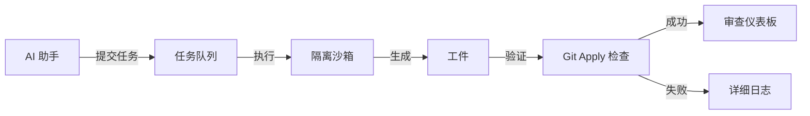

# MCP Task Relay

> **基于模型上下文协议构建的生产级异步任务执行系统**

[](https://www.typescriptlang.org/)
[](.)
[](https://modelcontextprotocol.io)

## MCP Task Relay 是什么？

MCP Task Relay (JobHub) 是一个企业级的异步任务执行系统，它在 AI 驱动的代码生成与生产部署之间架起了桥梁。基于模型上下文协议 (MCP) 构建，它将临时的 AI 建议转化为经过验证的、可用于生产的工件。

### 它解决的问题

现代 AI 编码助手（如 Claude、GPT-4 和 Codex）可以生成令人印象深刻的代码——但将这些代码集成到生产系统中仍然是一个手动的、容易出错的过程。MCP Task Relay 自动化了这一关键的最后一公里：



## 核心特性

### 🔒 **零 Any 类型安全**
使用 TypeScript 最严格的设置构建，MCP Task Relay 实现了完整的类型安全：

- ✅ **0 警告，0 错误**（103 条 lint 规则）
- ✅ 品牌类型防止 ID/提交哈希混淆
- ✅ 所有外部输入的 Zod 运行时验证
- ✅ `Result<T, E>` 模式消除异常处理错误

### ⚡ **异步优先架构**
提交任务后继续工作——通过服务器推送事件 (SSE) 实时更新：

```typescript
const { jobId } = await submit({
  repo: { url: "https://github.com/...", baseline: "abc123..." },
  task: { title: "添加认证", acceptance: [...] },
  execution: { model: "gpt-4", priority: "P0" }
});

// 任务异步运行
subscribe(`mcp://jobs/${jobId}/status`, (update) => {
  if (update.state === "SUCCEEDED") {
    review(update.artifacts.patch);
  }
});
```

### 🎯 **多执行器支持**
使用不同的 AI 后端运行任务：

- **Codex CLI**: 使用 `--sandbox read-only` 的非交互式执行
- **Claude Code**: 带结构化输出解析的 Agent 模式
- **可扩展**: 通过插件接口添加自定义执行器

### 📊 **生产监控**
实时 Web 仪表板：

- 任务统计（排队、运行中、成功、失败）
- 通过 SSE 实时状态更新
- 工件检查（差异、测试计划、说明）
- 详细的执行日志

### 🔍 **内置调试**
官方 MCP Inspector 集成，用于交互式测试：

```bash
bun run inspector  # 测试 MCP tools/resources
```

## 快速开始

### 安装

```bash
# 克隆仓库
git clone https://github.com/royisme/mcp-task-relay
cd mcp-task-relay

# 安装依赖（需要 bun）
bun install

# 运行数据库迁移
bun run migrate

# 以 MCP 模式启动
bun run dev
```

### 第一个任务提交

```typescript
// 通过 MCP tools
await mcp.callTool("jobs_submit", {
  spec: {
    repo: {
      type: "git",
      url: "https://github.com/user/repo.git",
      baseBranch: "main",
      baselineCommit: "a1b2c3d..." // 完整的 40 字符哈希
    },
    task: {
      title: "实现用户认证",
      description: "添加基于 JWT 的认证，包含刷新令牌",
      acceptance: [
        "用户可以使用邮箱/密码登录",
        "令牌在 1 小时后过期",
        "刷新端点正常工作"
      ]
    },
    execution: {
      preferredModel: "gpt-4",
      priority: "P1",
      ttlS: 3600
    },
    idempotencyKey: "auth-implementation-v1"
  }
});
```

## 架构亮点

### 状态机

```
QUEUED → RUNNING → SUCCEEDED
                 → FAILED (CONFLICT | BAD_ARTIFACTS | POLICY)
                 → CANCELED
                 → EXPIRED
```

### 工件生成

每个成功的任务会产生：

1. **`patch.diff`**: Git 兼容的统一差异格式
2. **`out.md`**: 测试计划 + 实现说明
3. **`logs.txt`**: 完整执行记录
4. **`pr.json`** *(可选)*: Pull Request 元数据

### 验证流程

```typescript
// 1. 在隔离环境中生成工件
const output = await executor.execute(spec, { workDir: "/tmp/job_123" });

// 2. 验证补丁可以干净地应用
await execa("git", ["apply", "--check", "patch.diff"]);

// 3. 更新任务状态
if (valid) {
  updateState(jobId, "SUCCEEDED");
  notifySubscribers();
}
```

## 为什么选择 MCP Task Relay？

### 对工程团队

- 通过自动化验证**减少 70% 的人工审查时间**
- **标准化 AI 输出**（跨不同模型/提供商）
- 所有 AI 生成代码变更的**审计追踪**
- 通过功能标志和优先队列**逐步采用**

### 对 AI 研究人员

- 跨不同提示的**基准执行器性能**
- **A/B 测试**模型配置
- 从验证的工件中**收集训练数据**
- 按任务复杂度**衡量成功率**

### 对平台工程师

- 使用 Redis 队列**水平扩展**（Phase 2）
- 通过结构化日志和指标实现**可观测性**
- **可扩展**的执行器插件系统
- 从第一天起就经过**战斗考验**的类型安全

## 下一步

继续阅读：

- [**快速开始**](getting-started.md): 详细的设置指南
- [**核心概念**](../concepts.md): 深入了解架构
- [**API 参考**](../api-reference.md): 完整的 MCP tools 文档

---

**构建技术**:
TypeScript • SQLite • MCP SDK • Zod • Bun

**许可证**: MIT
